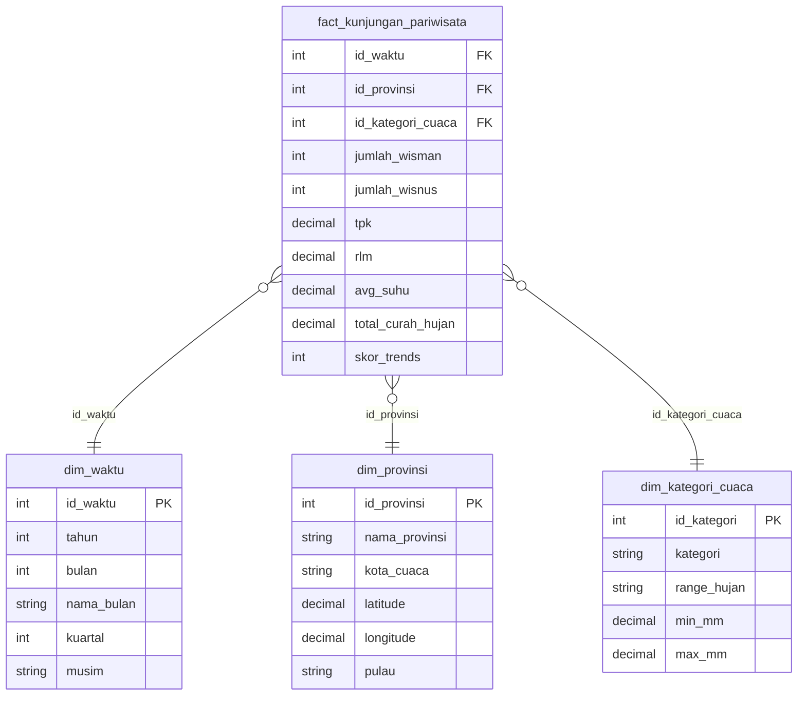

# Tourism-Weather Data Pipeline


An end-to-end data engineering pipeline correlating seasonal weather patterns and tourism demand across five Indonesian provinces (2023–2025), rebuilt individually using a code-first stack: **Python, BigQuery, dbt, and Airflow (Astronomer + Cosmos)**.

## 「 Background 」

Tourism is a major contributor to Indonesia's economy, but visitation is heavily influenced by weather conditions, and there is no unified data infrastructure integrating seasonal weather data and online search trends as explanatory factors for provincial-level visitation fluctuations. This project addresses that gap by integrating three heterogeneous data sources:

- **BPS (Badan Pusat Statistik)**: monthly foreign/domestic visitor counts and hotel occupancy rates
- **Open-Meteo Historical Weather API**: daily precipitation and temperature
- **Google Trends**: weekly search-interest score as a behavioral leading indicator

for five provinces spanning four major island groups: **Bali, DI Yogyakarta, Nusa Tenggara Barat, Sumatera Selatan, and Jawa Timur**, selected to represent diverse tourism profiles (international-dominant, domestic-dominant, heritage-based, nature-based).

## 𖠋 An individual rebuild 𖠋

This repository is an **individual, code-first reimplementation** of a group academic project originally built with Pentaho Data Integration (GUI-based ETL) and PostgreSQL. The original version demonstrated the data engineering lifecycle through visual, low-code transformations; this rebuild demonstrates the same lifecycle using tooling more representative of current industry practice. Python for extraction, BigQuery as the cloud warehouse, dbt for SQL-based transformation and testing, and Airflow for orchestration.

| Layer | Original (group project) | This rebuild |
|---|---|---|
| Extraction | Python scripts + manual BPS download | Python scripts (reused) |
| Storage / Warehouse | PostgreSQL (local) | BigQuery |
| Transformation | Pentaho PDI (GUI) | dbt (SQL, version-controlled) |
| Data quality | Manual Filter Rows steps | dbt tests (schema + custom) |
| Orchestration | Windows Task Scheduler | Airflow (Astro CLI + Cosmos) |

## Architecture


## ✰ Star schema ✰



## ⌬ Tech stack ⌬

- **Python**: extraction (`fetch_openmeteo.py`, `fetch_google_trends.py`) and consolidation of heterogeneous BPS tables (`import_bps.py`)
- **BigQuery**: cloud data warehouse, `raw` and `warehouse` datasets
- **dbt-core / dbt-bigquery**: staging, intermediate, and mart transformations; schema and custom data tests
- **Apache Airflow** (via Astro CLI): orchestration, monthly schedule
- **astronomer-cosmos**: runs the dbt project as native Airflow tasks, with dbt executed in an isolated virtual environment to avoid dependency conflicts with the Airflow runtime

## 🗁 Repository structure 🗁

The pipeline's source code lives inside the Astro project's `include/` folder, since that is what Astro CLI mounts into the Airflow containers at runtime. The full pipeline can also be run standalone (without Airflow) directly from these paths.

```
tourism-weather-pipeline/
├── airflow/                       # Astro CLI project (orchestration)
│   ├── dags/
│   │   └── tourism_weather_dag.py # DAG: extract -> load -> dbt (via Cosmos)
│   └── include/
│       ├── extract/               # fetch_openmeteo.py, fetch_google_trends.py, import_bps.py
│       ├── load/                  # load_to_bigquery.py
│       ├── data/raw/              # raw source files
│       └── dbt_project/
│           ├── models/
│           │   ├── staging/       # stg_bps_kunjungan, stg_cuaca_bulanan, stg_trends_bulanan
│           │   ├── intermediate/  # int_master_join
│           │   └── marts/         # dim_waktu, fact_kunjungan_pariwisata
│           ├── seeds/             # dim_provinsi.csv, dim_kategori_cuaca.csv
│           └── tests/             # assert_unique_province_month.sql
└── README.md
```

## ❯❯❯❯ Data pipeline ❯❯❯❯

1. **Extract** — `fetch_openmeteo.py` and `fetch_google_trends.py` pull from their respective APIs; `import_bps.py` consolidates dozens of heterogeneous BPS dynamic-table exports (two differing table structures) into one clean monthly province-level file
2. **Load** — `load_to_bigquery.py` writes raw extracts into BigQuery's `raw` dataset, unfiltered, preserving an audit trail
3. **Staging** (`dbt run --select staging`) — per-source cleaning, filtering, and standardizing province names
4. **Intermediate** — a single master join across BPS, weather, and trends staging models
5. **Marts** — star schema: one fact table (`fact_kunjungan_pariwisata`) and three dimensions (`dim_waktu`, `dim_provinsi`, `dim_kategori_cuaca`)
6. **Test** (`dbt test`) — not-null, accepted-range, referential integrity, and duplicate checks against the final fact table
7. **Orchestrate** — an Airflow DAG (`tourism_weather_pipeline`) runs extraction, load, and the full dbt project monthly

## ⟡ Data quality ⟡

Six checks (matching the original Pentaho `data_quality.ktr` logic, reimplemented as dbt tests): not-null on visitor counts and temperature, valid ranges for occupancy rate (0–100%), temperature (15–45°C), and rainfall (non-negative), referential integrity against `dim_provinsi`, and a duplicate check on province-month combinations.

## Setup

1. Create a BigQuery project with `raw` and `warehouse` datasets, and a service account with BigQuery Data Editor + Job User roles
2. `pip install -r requirements.txt` (or set up the dbt project's own environment) and set `GOOGLE_APPLICATION_CREDENTIALS`
3. Run extraction and load scripts, or trigger the Airflow DAG for the full pipeline
4. `cd airflow/include/dbt_project && dbt seed && dbt run && dbt test`

## ⛶ Screenshots ⛶


## ⚙ Acknowledgment ⚙

Adapted from a group academic project (COSC6097) analyzing seasonal weather patterns and tourism demand across Indonesian provinces, originally built with Pentaho Data Integration and PostgreSQL.
